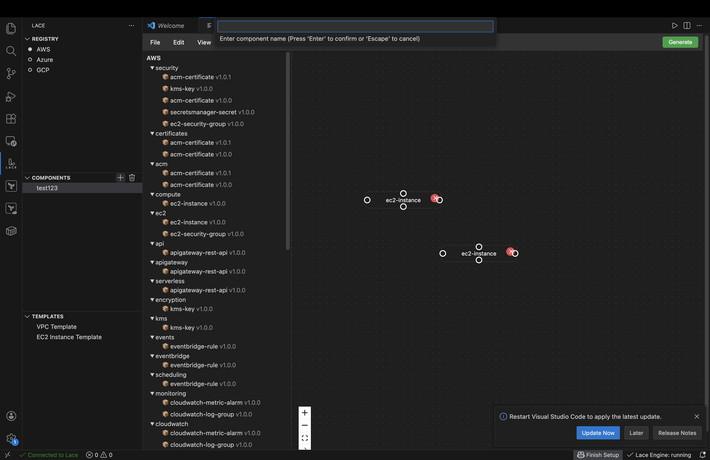

# Lace — Visual Terraform Module Composer

Lace is a VS Code extension that lets you visually compose Terraform infrastructure by browsing modules from a registry, wiring their inputs/outputs together on a canvas, and generating production-ready `.tf` files. It communicates with a Go CLI backend (`lace`) over JSON-RPC for registry access, validation, and code generation.



## Quick Start

```bash
# Install dependencies
npm install

# Build (extension backend + webview frontend)
npm run build

# Run tests
npm test

# Launch in VS Code
# Press F5 → opens Extension Development Host
```

In the Extension Development Host, click the **Lace** icon in the activity bar to browse the registry sidebar. Use `Lace: Open Canvas` to start composing, add modules from the sidebar or command palette, wire them together, configure inputs, and hit **Generate** to produce Terraform files in `.lace/`.

### Prerequisites

- **Node.js** ≥ 18, **npm** ≥ 9
- **VS Code** ≥ 1.96.0
- **Lace CLI** binary (default path: `/usr/local/bin/lace`; configurable via `lace.binaryPath` setting)
- CLI authenticated via `lace login` (the extension never manages tokens)

## Architecture Overview

The extension has two runtime halves joined by VS Code's webview messaging bridge:

```
┌──────────────────────────────┐       ┌──────────────────────────────┐
│         Host (Node.js)       │       │      Webview (Browser)       │
│                              │       │                              │
│  extension.ts                │ msg   │  Canvas.tsx (ReactFlow)      │
│  createWebviewPanel.ts  ◄────┼──────►│  reducer.ts (pure state)     │
│  RegistrySidebarProvider.ts  │       │  bundle.ts (toBundle/from)   │
│  ModuleDetailPanel.ts        │       │  panels/*.tsx (config UIs)   │
│  ServerManager + RPC Client  │       │  validate.ts (graph checks)  │
│         │                    │       │                              │
│         │ stdin/stdout       │       └──────────────────────────────┘
│         ▼                    │
│  ┌──────────────┐            │
│  │  lace CLI    │            │
│  │  (Go binary) │            │
│  └──────────────┘            │
└──────────────────────────────┘
```

### Data Flow

```
User action (add module, connect, rename, configure...)
       │
       ▼
WorkspaceAction                   ← semantic action with module_key
       │
       ▼
workspaceReducer(state, action)   ← pure: (WorkspaceState, Action) → WorkspaceState
       │
       ▼
WorkspaceState                    ← ModuleBundle & { layouts }
       │
       ├── save ──→ .lace/lace.json (version-controlled)
       ├── render ──→ deriveEdges(instances) ──→ ReactFlow nodes + edges
       └── generate ──→ toBundle(workspace) ──→ validate ──→ generate ──→ .lace/*.tf
```

### Persistence: The `.lace/` Directory

Lace stores everything in a `.lace/` directory at the workspace root — like `.github/`, `.vscode/`, or `.husky/`:

```
my-app/
  src/
  .lace/
    lace.json       ← the bundle (source of truth, version-controlled)
    main.tf         ← generated
    variables.tf    ← generated
    providers.tf    ← generated
    ...
```

`lace.json` is the bundle — the same `ModuleBundle` format used everywhere in the system. Registry modules are bundles. Your project is a bundle that composes other bundles. It's fractal — bundles all the way down.

One workspace = one component. No global storage, no naming, no component lists.

## UX: Two Access Patterns

**Sidebar (discovery flow):** The registry sidebar is a `WebviewViewProvider` with an inline search box (like VS Code's Extensions panel). Type to filter, click a module to open its detail tab (versions, interface, inputs/outputs), then "Add to Canvas" from the detail panel.

**Command palette (power user flow):** `Lace: Add Module to Canvas` opens a quick pick — select a module and it drops directly onto the canvas. No detail panel, no extra clicks.

Both flows converge on the same `dropModuleToCanvas` function.

## Commands

| Command                           | Purpose                                               |
| --------------------------------- | ----------------------------------------------------- |
| `Lace: Open Canvas`               | Open (or create) the canvas for the current workspace |
| `Lace: Add Module to Canvas`      | Quick pick → drop module onto canvas                  |
| `Lace: Generate Terraform`        | Validate + generate `.tf` files into `.lace/`         |
| `Lace: Terraform Validate`        | Run `lace terraform validate` on `.lace/`             |
| `Lace: Terraform Format`          | Run `lace terraform fmt` on `.lace/`                  |
| `Lace: Terraform Security Scan`   | Run `lace terraform scan` on `.lace/`                 |
| `Lace: Terraform Docs`            | Run `lace terraform docs` on `.lace/`                 |
| `Lace: Start/Stop/Restart Engine` | Manage the CLI process                                |

Terraform commands open an integrated terminal and shell out to the CLI.

## Project Structure

```
src/
├── extension.ts                  # VS Code activation, commands, engine lifecycle
├── types/
│   └── protocol.ts               # Host↔webview message unions, RegistryModule, Diagnostic
├── utilities/engine/
│   ├── server-manager.ts         # Spawns lace CLI, manages lifecycle
│   └── rpc-client.ts             # JSON-RPC 2.0 over stdin/stdout
├── containers-views/
│   └── RegistrySidebarProvider.ts  # WebviewViewProvider with inline search
└── webview/
    ├── index.tsx                  # React entry point
    ├── App.tsx                    # ReactFlowProvider wrapper
    ├── Canvas.tsx                 # Main canvas: nodes, edges, panels, toolbar
    ├── ModuleDetailPanel.ts       # Extensions-style module detail tab
    ├── createWebviewPanel.ts      # Host-side: .lace/ persistence, validation, generate
    ├── getWebviewContent.ts       # HTML shell + toolbar buttons
    ├── state/
    │   ├── reducer.ts             # Pure reducer: 16 action types
    │   └── context.ts             # CanvasContext for node↔canvas communication
    ├── types/
    │   ├── ir.ts                  # Core IR types matching Go wire format exactly
    │   └── workspace.ts           # WorkspaceState = ModuleBundle & { layouts }
    ├── utils/
    │   ├── bundle.ts              # toBundle / fromBundle / emptyWorkspace
    │   ├── derive.ts              # Derive edges + wires from out bindings
    │   ├── validate.ts            # Graph validation (duplicates, dangling refs)
    │   ├── resolve.ts             # Schema resolution for instances
    │   ├── identifiers.ts         # Terraform identifier validation/generation
    │   └── record.ts              # mapRecord / filterRecord utilities
    ├── components/
    │   ├── nodes/
    │   │   ├── ModuleNode.tsx     # Leaf module node (with error highlighting)
    │   │   └── CompositeNode.tsx  # Composite node (double-click to navigate in)
    │   ├── panels/                # 8 config panels (inputs, edges, variables, etc.)
    │   ├── Breadcrumb.tsx         # Composite navigation breadcrumb
    │   └── ErrorBoundary.tsx      # React error boundary
    └── __tests__/
        ├── fixtures/              # Real CLI bundle snapshots
        └── *.test.ts              # 9 test suites, 95 tests
```

## Core Concepts

### Module Bundle

The wire format exchanged between the extension and CLI. A `ModuleBundle` contains a flat map of `ModuleDef` entries (keyed as `id@version`) and an `entry` reference pointing to the root composite.

### Workspace State

`WorkspaceState = ModuleBundle & { layouts }`. The `layouts` record stores per-composite node positions for the canvas. `toBundle()` strips layouts; `fromBundle()` adds them.

### Binding System

Every instance input is a discriminated union — exactly one variant is set: `lit` (literal value), `var` (composite variable reference), `out` (sibling output reference), or `expr` (raw HCL expression).

### Wires

Wires are **never stored** in workspace state. They are derived from `out` bindings in `toBundle()` and stripped by `fromBundle()`. This is a core invariant.

## Testing

```bash
npm test              # Run all 95 tests
npm run test:watch    # Watch mode
```

| Suite                      | Tests | Coverage                                            |
| -------------------------- | ----- | --------------------------------------------------- |
| `reducer.test.ts`          | 26    | Core editing, interface, and grouping actions       |
| `terraform-config.test.ts` | 18    | Terraform config actions, full bundle round-trip    |
| `grouping.test.ts`         | 13    | `GROUP_INTO_COMPOSITE` with cross-boundary wires    |
| `identifiers.test.ts`      | 8     | Terraform identifier validation/collision           |
| `bundle.test.ts`           | 7     | `toBundle`/`fromBundle` round-trip, boundary errors |
| `normalize.test.ts`        | 7     | Binding normalization for all 4 variants            |
| `validate.test.ts`         | 6     | Duplicate IDs, dangling refs, depends_on            |
| `scaffold.test.ts`         | 6     | `emptyWorkspace` factory + round-trip fidelity      |
| `derive.test.ts`           | 4     | Edge/wire derivation from out bindings              |

## Configuration

| Setting            | Default               | Description                                  |
| ------------------ | --------------------- | -------------------------------------------- |
| `lace.binaryPath`  | `/usr/local/bin/lace` | Path to the Lace CLI binary                  |
| `lace.autoStart`   | `true`                | Start CLI engine on extension activation     |
| `lace.autoRestart` | `true`                | Auto-restart engine on crash (up to 3 times) |

## Build System

- **Bundler**: [Rspack](https://rspack.dev/) with two entries — `extension.ts` (Node.js target) and `webview/index.tsx` (browser target)
- **Styling**: Tailwind CSS v4 via PostCSS
- **TypeScript**: Strict mode
- **Test runner**: Vitest
- **Formatting**: Prettier (enforced via lint-staged + Husky)
